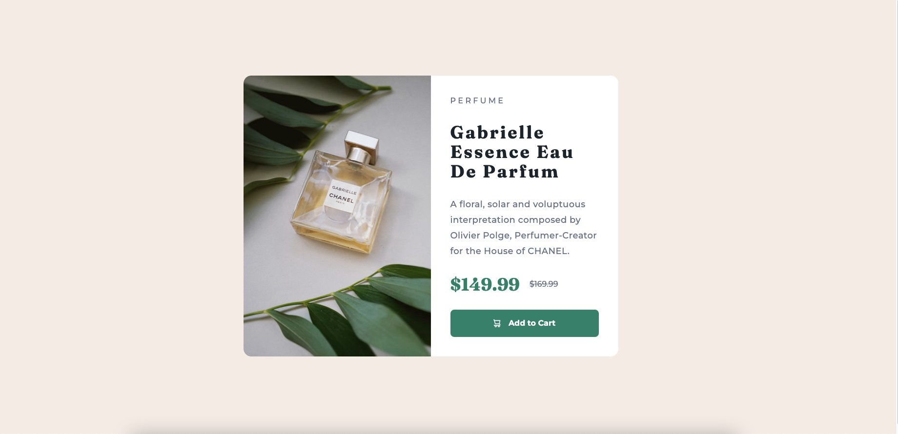

# Frontend Mentor - QR code component solution

This is a solution to the [QR code component challenge on Frontend Mentor](https://www.frontendmentor.io/challenges/qr-code-component-iux_sIO_H). Frontend Mentor challenges help you improve your coding skills by building realistic projects.

## Table of contents

- [Overview](#overview)
  - [Screenshot](#screenshot)
  - [Links](#links)
- [My process](#my-process)
  - [Built with](#built-with)
- [Author](#author)
- [Acknowledgments](#acknowledgments)

## Overview

### Screenshot



### Links

- Solution URL: [Add solution URL here](https://your-solution-url.com)
- Live Site URL: [Add live site URL here](https://your-live-site-url.com)

## My process
Using Tailwindcss i have been able to work on designs much faster and i want to learn more by working on more projects at frontendmentor to help me be good at it.

### Built with

- TailwindCss

### What I learned

Second Project using TailwindCSS.So far so good.I was faced with one big issue regarding the switch of imaages from mobile view to desktop view.I was able to figure it out using relative and absolute  between medium screen breakpoint.The code below was one important key thing i was able to identify.

```html
<!--Image Desktop-->
          <div class="invisible absolute md:visible md:relative">
            
          </div>
          <!--Image Mobile-->
          <div class="md:hidden ">
            
          </div>
```
## Author

- Frontend Mentor - [@Kofiastro](https://www.frontendmentor.io/profile/kofiastro)

## Acknowledgments

Big thanks to Traversy Media and the frontendmentor team 🎉
